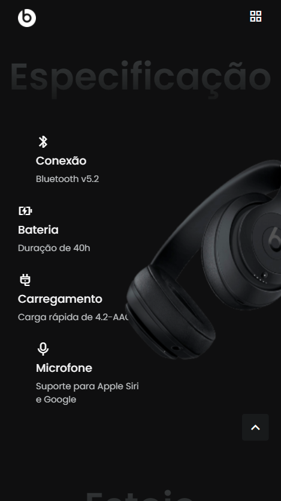
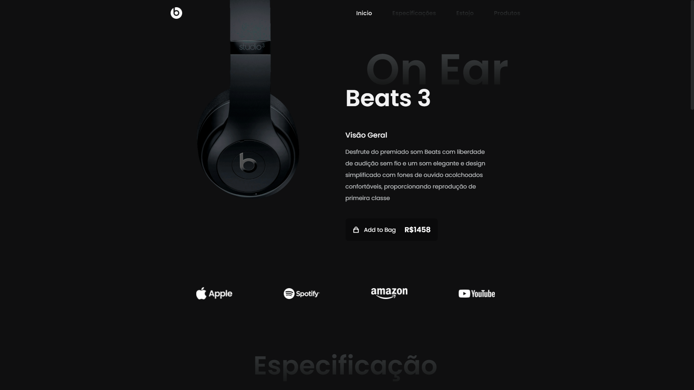
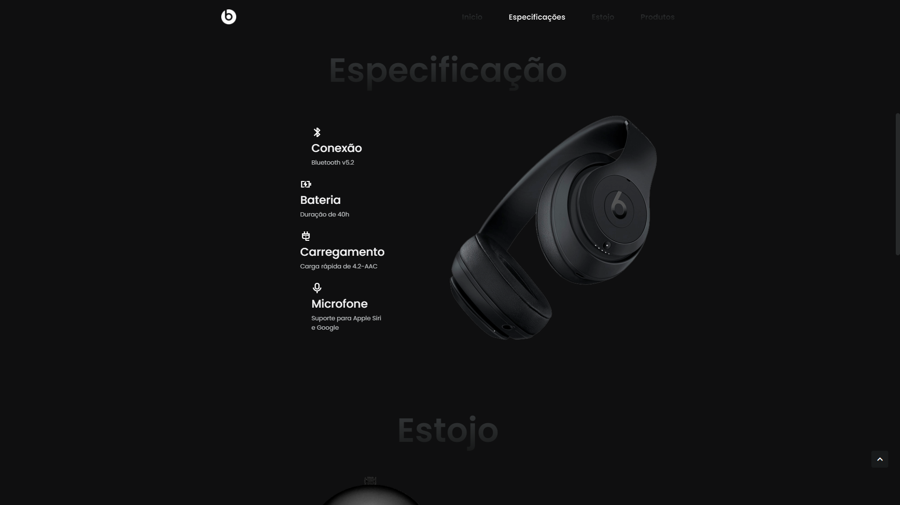
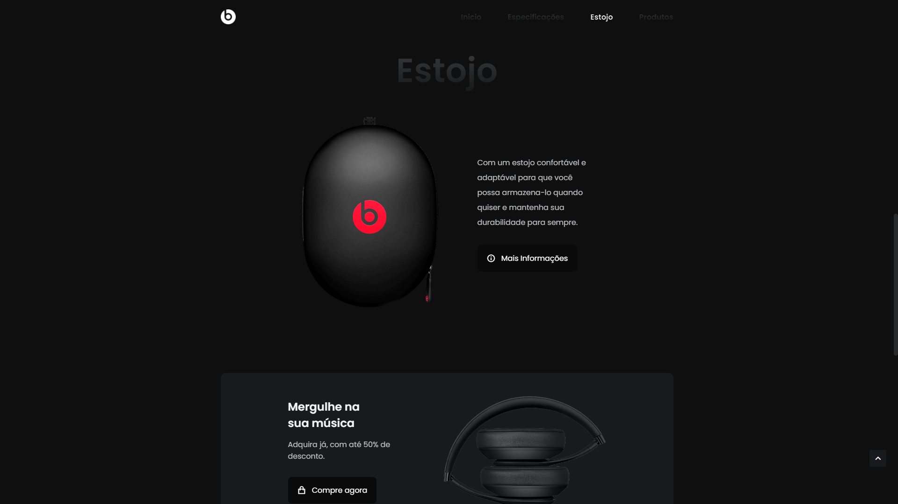
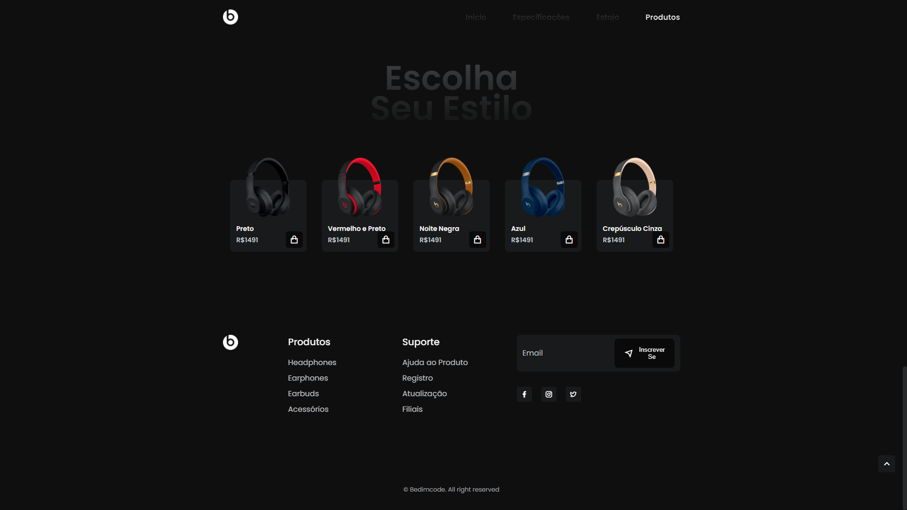
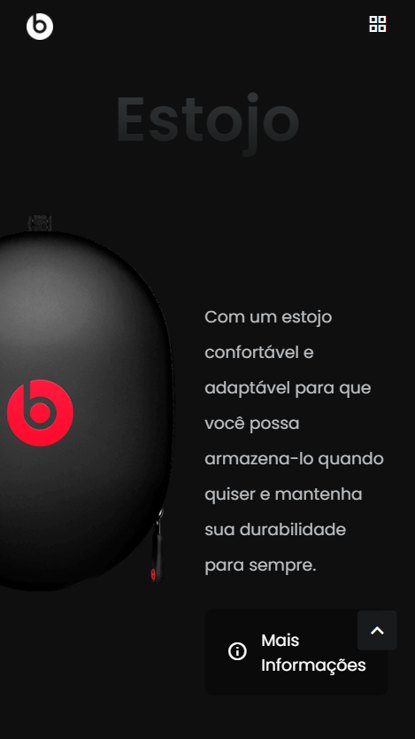
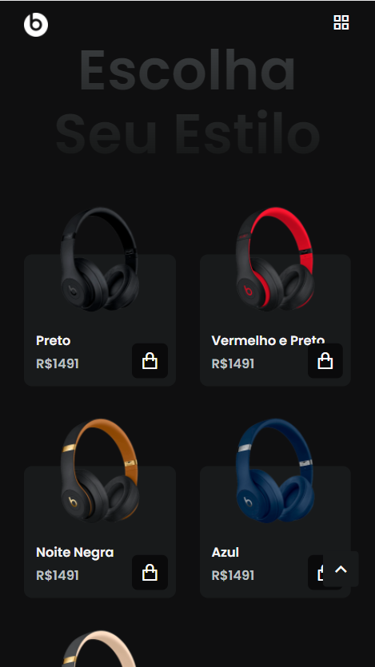

# Responsive Layout E-Commerce

<!---Esses são exemplos. Veja https://shields.io para outras pessoas ou para personalizar este conjunto de escudos. Você pode querer incluir dependências, status do projeto e informações de licença aqui--->

 

>  Um exemplo de site com reponsividade para lojas online
### Etapas de desenvolvimento

O projeto já está concluido. Sendo que o desenvolvimento foi dividido em etapas: 

- [x] Definir padrao de cores.
- [x] Criar cabeçalho com navegação.
- [x] Criar home do site e adicionar fundo ao cabeçalho quando ouvesse uma rolagem da pagina.
- [x] Criar seções sponsor, specs e case do site.
- [x] Criar seções discount e products do site.
- [x] Criar footer da pagina.
- [x] Adicionar um butão de ScrollUp. Adicionar cor no item do menu, caso seja onde o usuario esta localizado na pagina e mudar o Scroll Bar da pagina.
- [x] Melhorar aparencia do site para telas muito pequenas, medias e grandes.

## 💻 Pré-requisitos

O único requisito é ter um servidor para rodar o layout, isso vai de sua preferência.

## 💻 Em tela grande:

 
 

## 📱 Em tela pequena:

   